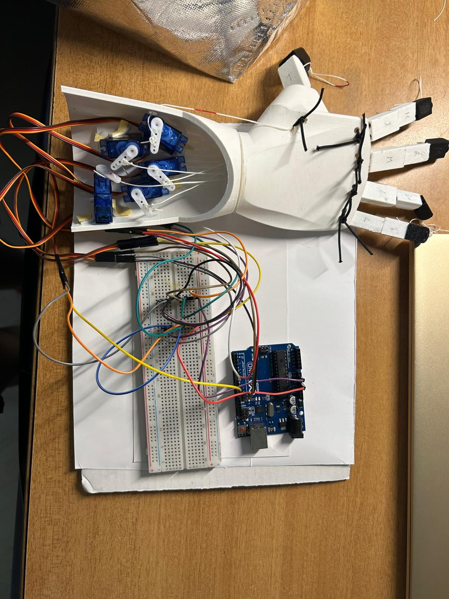

# Robotic Hand – Real-Time Sign Language Translation 🤖

This project presents a cyber-physical robotic system that translates spoken or written input into American Sign Language (ASL) gestures using a 3D-printed robotic hand, Python-based NLP processing, and Arduino-controlled servo motors.

> Developed as part of the Experiential Learning Program at RV College of Engineering, Bengaluru (2024–25)

---

## 🎯 Objective

To bridge the communication gap between sign language users and non-signers by providing a real-time assistive solution that interprets natural language into ASL gestures using an affordable, programmable robotic hand.

---

## ⚙️ Tech Stack

- **Languages:** Python, C (Arduino)
- **Libraries:** speech_recognition, nltk, pyfirmata2, time
- **Hardware:** Arduino UNO, SG90 Micro Servos, Jumper Wires, Microphone, Elastic Wire
- **Design Tools:** SolidWorks (3D Modeling), 3D Printing

---

## 📂 Folder Structure

robotic-hand-asl/
├── README.md
├── main.py
├── images/
│   └── hand_demo.jpg
├── hardware/
│   └── solidworks_model.stl
├── docs/
│   └── final_report.pdf

---

## 🧠 How It Works

1. **Voice/Text Input** – Captured using a microphone or entered manually.
2. **Text Processing** – Tokenized and cleaned using NLTK.
3. **Gesture Mapping** – Each letter/digit mapped to servo movements.
4. **Execution** – Arduino rotates servos to replicate ASL finger gestures.

---

## ✅ Features

- Real-time ASL conversion from speech or typed text
- 90% accuracy for alphabets and digits under lab conditions
- 3D-printed hand with tension-based actuation and elastic recoil
- Modular and scalable servo control logic

---

## 🧪 Results

- Stable gesture reproduction for all alphabets
- Accurate lemmatization and parsing using NLTK
- Smooth servo transitions with reduced jitter

---

## 📸 Visuals

(Insert images into the images/ folder and link here, e.g.,)

---

## 🚀 Future Scope

- Add gestures for words and dynamic phrases
- Integrate camera vision for two-way communication
- Port to STM32 for improved timing control

---

## 👨‍💻 Authors

**Team Robo Squad** – RV College of Engineering  
- Joel Saha (ECE)  
- Heeral Khare (ECE)  
- Preetham V (ETE)  
- Sneha Pandey (ETE)

---

## 📄 Full Report

Refer to: [final_report.pdf](final_report.pdf)

---

## 📬 Contact

- Email: preethamv.et23@rvce.edu.in
- GitHub: https://github.com/preethamv6
- LinkedIn: https://linkedin.com/in/preetham-v

---

"Engineering systems that sense, speak, and simplify communication."
